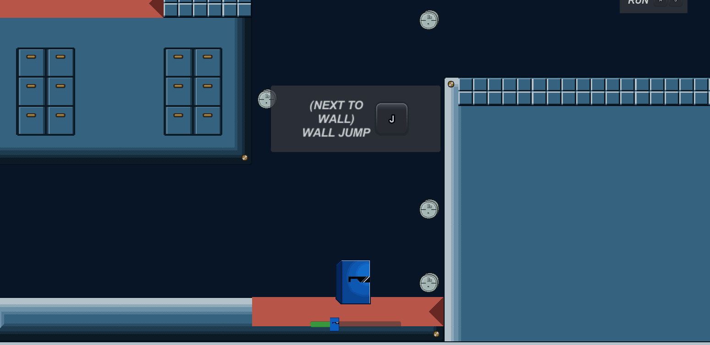

# flow
C# program files used for flow 0.3.8

Flow is a deep, fast-paced game that allows players freedom of movement as far as their skill is able to take them.

The premise is simple, just hit the key into the lock to progress onto the next level.

However you must not let the key touch the *orange stuff™*, or else the key will despawn.

Things get a bit more interesting once you start adding more keys to the mix.

Oh... you can also wall jump by the way.

Once we add that, we can start to have a little more fun. 

Levels flow seemlessly into one another while progressively increasing in difficulty.

Once you're finished you must hide away your cash ... and you're off to your next heist.

The only thing limitting your speed is yourself, go back to older levels and blaze through them with your improved skills.

